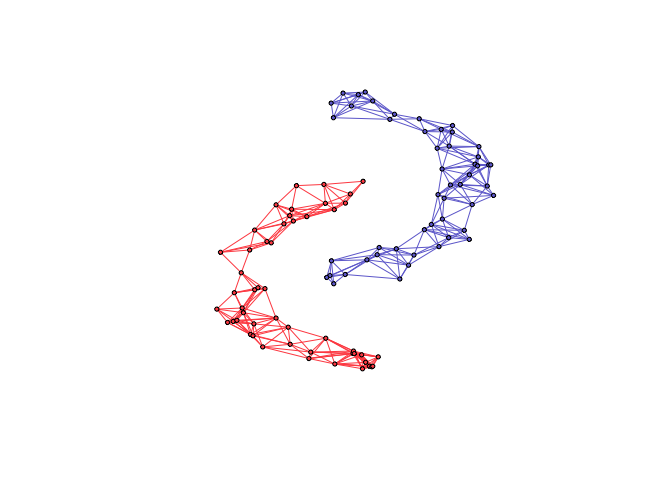

# Spatial datasets
{: .no_toc }

## Table of contents
{: .no_toc .text-delta }

1. TOC
{:toc}

---

## Two moon dataset

```r
library(spectralGraphTopology)
library(clusterSim)
library(igraph)

set.seed(42)
# number of nodes per cluster
n <- 50
# generate datapoints
twomoon <- shapes.two.moon(n)
# number of components
k <- 2
# estimate underlying graph
S <- crossprod(t(twomoon$data))
graph <- learn_laplacian_matrix(S, k = k, beta = .5, verbose = FALSE, abstol = 1e-3)
# build network
net <- graph_from_adjacency_matrix(graph$Adjacency, mode = "undirected", weighted = TRUE)
# colorify nodes and edges
colors <- c("#706FD3", "#FF5252")
V(net)$cluster <- twomoon$clusters
E(net)$color <- apply(as.data.frame(get.edgelist(net)), 1,
                      function(x) ifelse(V(net)$cluster[x[1]] == V(net)$cluster[x[2]],
                                        colors[V(net)$cluster[x[1]]], '#000000'))
V(net)$color <- colors[twomoon$clusters]
# plot nodes
plot(net, layout = twomoon$data, vertex.label = NA, vertex.size = 3)
```


