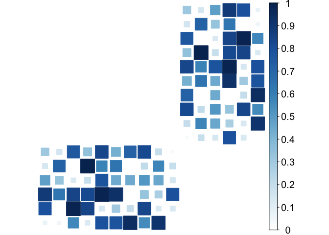
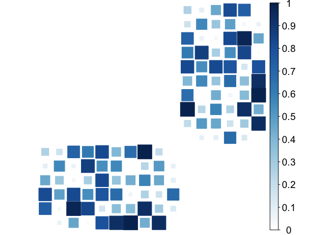

# Grid
{: .no_toc }

## Table of contents
{: .no_toc .text-delta }

1. TOC
{:toc}

---

``` r
library(spectralGraphTopology)
library(igraph)
library(viridis)
library(corrplot)

n1 <- 10
n2 <- 6
n <- n1 + n2
pc <- .9

bipartite <- sample_bipartite(n1, n2, type="Gnp", p = pc, directed=FALSE)
# randomly assign edge weights to connected nodes
E(bipartite)$weight <- runif(gsize(bipartite), min = 0, max = 1)
# Erdo-Renyi as noise model
a <- .35
erdos_renyi <- erdos.renyi.game(n, p = .35)
E(erdos_renyi)$weight <- runif(gsize(erdos_renyi), min = 0, max = a)
Lerdo <- as.matrix(laplacian_matrix(erdos_renyi))
# get true Laplacian and Adjacency
Ltrue <- as.matrix(laplacian_matrix(bipartite))
Atrue <- diag(diag(Ltrue)) - Ltrue
Lnoisy = Ltrue + Lerdo
Anoisy <- diag(diag(Lnoisy)) - Lnoisy
# set number of samples
Y <- MASS::mvrnorm(10 * n, rep(0, n), Sigma = MASS::ginv(Lnoisy))
# compute sample covariance matrix
S <- cov(Y)
graph <- learn_bipartite_graph(S, w0 = "qp", verbose = FALSE)
corrplot(Atrue / max(Atrue), is.corr = FALSE, method = "square", addgrid.col = NA, tl.pos = "n", cl.cex = 1.25)
corrplot(Anoisy / max(Anoisy), is.corr = FALSE, method = "square", addgrid.col = NA, tl.pos = "n", cl.cex = 1.25)
corrplot(graph$Adjacency / max(graph$Adjacency), is.corr = FALSE, method = "square", addgrid.col = NA, tl.pos = "n", cl.cex = 1.25)
```

True adjacency             |  Noisy adjacency          |  Estimated adjacency
:-------------------------:|:-------------------------:|:------------------------:
 |  | 
